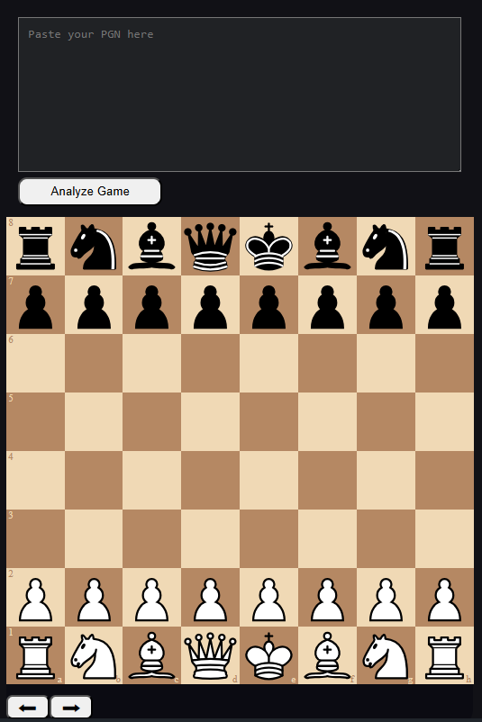
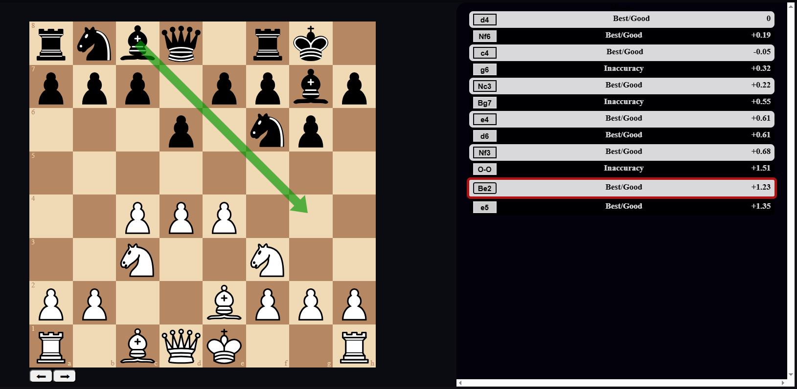

# Chess Analysis App

A **full-stack web application** that analyzes chess games using my own C++ chess engine.

The project was created to learn how to integrate a native application with a web backend and frontend. Users can submit a PGN game, which is analyzed by the engine and displayed in the browser.

## Features

- PGN game analysis
- Custom C++ chess engine integration
- UCI protocol communication
- Web-based interface
- Backend API for analysis requests

## Tech Stack

- C++
- Node.js
- Express
- ReactJS

## Current Status

The application works locally and successfully communicates with the chess engine.

The deployed version on Render currently has an **unresolved issue** where the engine process unexpectedly **terminates during analysis requests**. Extensive debugging was performed, but the root cause has not yet been identified.

The source code remains fully available as a demonstration of the application's architecture, engine integration, and development process.

